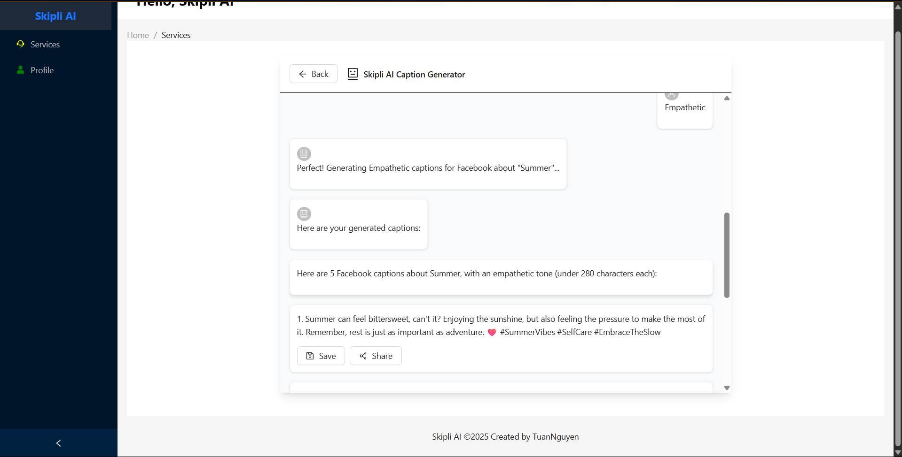

# Skipli AI Website

## Overview

This frontend provides a user interface for the Skipli AI backend, allowing users to interact with phone number
verification, content generation, and user content management features.

## Installation

1. Clone the repository:
   ```bash
   git clone
    ```
2. Navigate to the project directory:
    ```bash
    cd skipli-ai-website
    ```
3. Install dependencies:
    ```bash
    npm install
    ```
4. Set up environment variables in a `.env` file:
    ```plaintext
   VITE_FIREBASE_API_KEY=your_firebase_api_key
    VITE_FIREBASE_AUTH_DOMAIN=your_firebase_auth_domain
    VITE_FIREBASE_PROJECT_ID=your_firebase_project_id
    VITE_FIREBASE_STORAGE_BUCKET=your_firebase_storage_bucket
    VITE_FIREBASE_MESSAGING_SENDER_ID=your_firebase_messaging_sender_id
    VITE_FIREBASE_APP_ID=your_firebase_app_id
    VITE_FIREBASE_MEASUREMENT_ID=your_firebase_measurement_id
    ```
5. Start the development server:
    ```bash
    npm run dev
    ```

## Features

- **Phone Number Verification:** Users can verify their phone numbers via OTP.

- **Content Generation:** Users can generate post captions and get post ideas based on topics.

- **User Content Management:** Users can view and manage their generated content.

## Root Structure

```
skipli/
├── public/                     # Static assets
├── src/                        # Source code
├── ├── components/             # Reusable components
├── ├── components/ui/          # UI components (e.g., Sidebar, Animating texts,...)
├── ├── components/fragments/   # Fragment components
├── ├── pages/                  # Page components
├── ├── services/               # API service functions
├── ├── config/                 # Configuration files (e.g., Firebase, Axios)
├── ├── App.jsx                 # Main application component
├── ├── index.jsx               # Entry point
├── ├── App.css                 # Main CSS file
```

## Images

*- **Verification Page:**


*- **Content Generation Page:**
